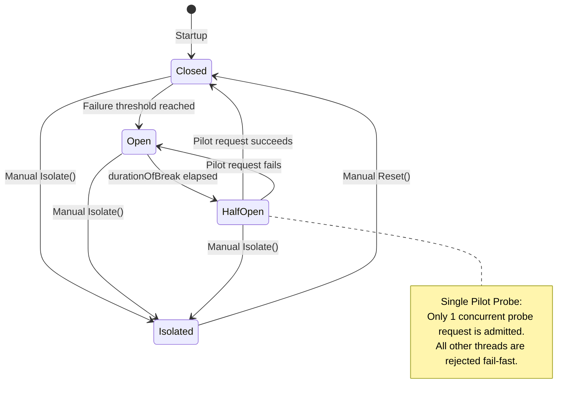
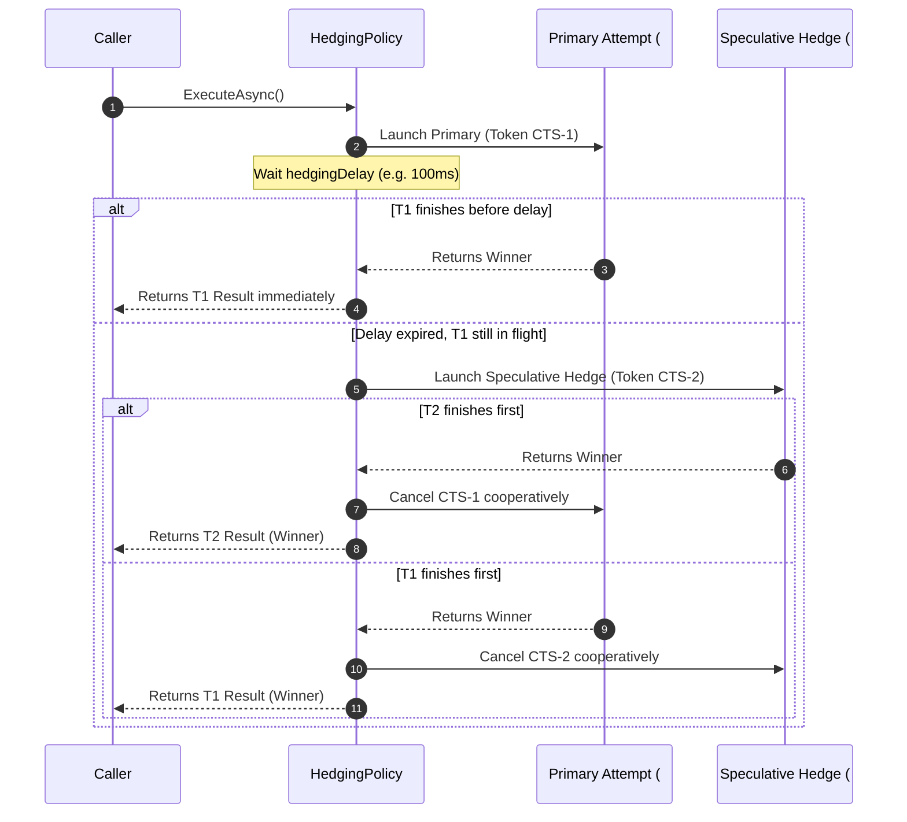

# Vard

<div align="center">
  

  <br/><br/>

[](https://www.nuget.org/packages/Vard/)
[](https://learn.microsoft.com/en-us/dotnet/standard/net-standard)
[](#philosophy--engineering)
[](LICENSE)
[](#quality--testing)

**Frictionless, type-safe, zero-dependency resilience and fault-tolerance toolkit for .NET.**

[Português](README.md) | **English** | [Español](README.es.md)

</div>

---

## Table of Contents

- [Overview](#overview)
- [Philosophy & Engineering](#philosophy--engineering)
- [Installation](#installation)
- [Quickstart](#quickstart)
- [Architecture & Internal Engineering](#architecture--internal-engineering)
  - [Canonical Pipeline (Outside-In)](#1-canonical-pipeline-outside-in)
  - [Circuit Breaker State Machine](#2-circuit-breaker-state-machine)
  - [Hedging Speculative Flow](#3-hedging-speculative-flow)
- [The 7 Resilience Policies](#the-7-resilience-policies)
  - [1. Retry (Attempts with Jitter)](#1-retry-attempts-with-jitter)
  - [2. Circuit Breaker (Reactive & Predictive Breaker)](#2-circuit-breaker-reactive--predictive-breaker)
  - [3. Timeout (Cooperative Cancellation)](#3-timeout-cooperative-cancellation)
  - [4. Fallback (Graceful Degradation)](#4-fallback-graceful-degradation)
  - [5. Bulkhead (Concurrency Isolation)](#5-bulkhead-concurrency-isolation)
  - [6. Rate Limiter (Throughput Control)](#6-rate-limiter-throughput-control)
  - [7. Hedging (p99 Speculative Execution)](#7-hedging-p99-speculative-execution)
- [Pipeline Composition (PolicyWrap)](#pipeline-composition-policywrap)
  - [Enterprise High-Availability Pipeline](#enterprise-high-availability-pipeline)
  - [Low-Latency Speculative Pipeline](#low-latency-speculative-pipeline)
- [Observability, Context & PolicyResult](#observability-context--policyresult)
- [Vard vs Polly](#vard-vs-polly)
- [Roadmap & Future Implementations](#roadmap--future-implementations)
- [Demo Project](#demo-project)
- [Quality & Testing](#quality--testing)
- [License](#license)

---

## Overview

**Vard** is a fault-tolerance library for .NET (.NET Standard 2.1+) engineered for high-scale distributed systems and mission-critical microservices. It delivers the 7 core resilience engineering patterns with an intuitive fluent API, deterministic execution times, and a strict guarantee of zero transitive dependencies.

Built around strict isolation and production stability, Vard protects applications against cascading failures, thread pool exhaustion, latency spikes (tail latency p99), and downstream outages.

---

## Philosophy & Engineering

- **Zero External Dependencies (Pure .NET BCL):** Vard depends exclusively on the base class library (.NET Standard 2.1 BCL). No third-party packages, zero risk of logging version collisions or dependency hell.
- **Minimal Allocation & Steady-State Zero-Alloc:** Sliding windows and rate limiters use pre-allocated circular ring buffers (`BucketedSlidingWindow`) with $O(1)$ time complexity and zero heap allocations during steady-state traffic.
- **Lock-Free Atomic Coordination:** The Circuit Breaker state machine performs lock-free state transitions via `Interlocked` (*Single Pilot Request*), preventing concurrent request storms from overwhelming a recovering service.
- **Lazy Mathematical Token Bucket:** Replenishment tokens are computed continuously on-demand via monotonic stopwatch ticks without spinning background timers or consuming ThreadPool threads.
- **Genuine Cooperative Cancellation:** Asynchronous policies propagate and respect `CancellationToken`, guaranteeing immediate socket and HTTP connection teardown.

---

## Installation

Install via the .NET CLI:

```bash
dotnet add package Vard
```

Or via the NuGet Package Manager:

```powershell
Install-Package Vard
```

---

## Quickstart

```csharp
using System;
using System.Net.Http;
using System.Threading.Tasks;
using Vard.Builders;
using Vard.Abstractions;

// Build a resilient Retry policy with Exponential Backoff and AWS Full Jitter
var retryPolicy = VardPolicy
    .Handle<HttpRequestException>()
    .Or<TimeoutException>()
    .RetryWithBackoff(
        retryCount: 3,
        initialDelay: TimeSpan.FromMilliseconds(100),
        backoffType: BackoffType.Exponential,
        useJitter: true,
        onRetryAsync: (ex, res, attempt, delay, ctx) =>
        {
            Console.WriteLine($"[Retry] Attempt #{attempt} failed: {ex?.Message}. Waiting {delay.TotalMilliseconds:F0}ms...");
            return Task.CompletedTask;
        });

// Execute protected operation
var response = await retryPolicy.ExecuteAsync(async ct =>
{
    using var client = new HttpClient();
    return await client.GetStringAsync("https://api.example.com/data", ct);
});
```

---

## Architecture & Internal Engineering

### 1. Canonical Pipeline (Outside-In)

When combining multiple resilience policies, execution follows an **Outside-In** layer model:


### 2. Circuit Breaker State Machine

The Circuit Breaker implements a 4-state machine featuring an atomic **Single Pilot Request** in `HalfOpen`:



### 3. Hedging Speculative Flow

Hedging dispatches speculative concurrent executions when the primary attempt exceeds a configurable latency threshold, returning the fastest winner and cooperatively cancelling the rest:



---

## The 7 Resilience Policies

### 1. Retry (Attempts with Jitter)

Protects against transient network failures with customizable backoff strategies: Fixed, Linear, and Exponential with AWS Full Jitter.

```csharp
var retry = VardPolicy
    .Handle<HttpRequestException>()
    .RetryWithBackoff(
        retryCount: 3,
        initialDelay: TimeSpan.FromMilliseconds(100),
        backoffType: BackoffType.Exponential,
        useJitter: true,
        onRetryAsync: (ex, res, attempt, delay, ctx) =>
        {
            Console.WriteLine($"Attempt {attempt} failed. Retrying in {delay.TotalMilliseconds}ms");
            return Task.CompletedTask;
        });
```

### 2. Circuit Breaker (Reactive & Predictive Breaker)

Prevents cascading outages by cutting traffic to failing dependencies. Supports Count-based (N consecutive failures) and Advanced Rate-based (percentage in a sliding window).

```csharp
// Count-based Circuit Breaker
var breaker = VardPolicy
    .Handle<HttpRequestException>()
    .CircuitBreaker(
        exceptionsAllowedBeforeBreaking: 3,
        durationOfBreak: TimeSpan.FromSeconds(15),
        onBreak: (ex, duration, ctx) => Console.WriteLine($"Circuit OPEN for {duration.TotalSeconds}s"),
        onReset: ctx => Console.WriteLine("Circuit CLOSED"),
        onHalfOpen: ctx => Console.WriteLine("Circuit HALF-OPEN (testing trial probe)"));

// Advanced Rate-based Circuit Breaker (Sliding Window O(1))
var advancedBreaker = VardPolicy
    .Handle<HttpRequestException>()
    .AdvancedCircuitBreaker(
        failureThreshold: 0.5, // 50% failure rate
        samplingDuration: TimeSpan.FromSeconds(30),
        minimumThroughput: 20,
        durationOfBreak: TimeSpan.FromSeconds(10));
```

### 3. Timeout (Cooperative Cancellation)

Ensures operations do not block indefinitely, enforcing strict latency budgets via linked `CancellationToken`.

```csharp
var timeout = VardPolicy.Timeout(
    timeout: TimeSpan.FromMilliseconds(500),
    onTimeout: (ctx, duration) => Console.WriteLine($"Timed out after {duration.TotalMilliseconds}ms"));

var data = await timeout.ExecuteAsync(async ct =>
{
    return await httpClient.GetStringAsync("https://api.example.com", ct);
});
```

### 4. Fallback (Graceful Degradation)

Provides an alternative value, default payload, or degraded cache response when the primary operation fails.

```csharp
var fallback = VardPolicy
    .Handle<HttpRequestException>()
    .Or<TimeoutRejectedException>()
    .Fallback(
        fallbackValue: "Cached local data",
        onFallback: (ex, ctx) => Console.WriteLine($"Fallback active: {ex?.Message}"));
```

### 5. Bulkhead (Concurrency Isolation)

Limits the number of concurrent executions allowed and provides a bounded queue, isolating resources and preventing thread starvation.

```csharp
var bulkhead = VardPolicy.Bulkhead(
    maxParallelization: 10,
    maxQueuedActions: 20,
    onBulkheadRejectedAsync: ctx =>
    {
        Console.WriteLine("Bulkhead saturated! Request rejected.");
        return Task.CompletedTask;
    });
```

### 6. Rate Limiter (Throughput Control)

Protects APIs against traffic spikes and enforces rate quotas. Includes Token Bucket (burst + continuous refill) and Sliding Window ($O(1)$ ring buffer).

```csharp
// Token Bucket: capacity of 100, refills 20 tokens/sec
var tokenBucket = VardPolicy.TokenBucket(
    maxTokens: 100,
    tokensPerSecond: 20.0,
    onRateLimitExceeded: (retryAfter, ctx) =>
    {
        Console.WriteLine($"Rate limit reached! Retry after {retryAfter.TotalMilliseconds}ms");
    });

// Sliding Window: 100 requests per 1-minute window
var slidingWindow = VardPolicy.SlidingWindow(
    permitLimit: 100,
    windowDuration: TimeSpan.FromMinutes(1));
```

### 7. Hedging (p99 Speculative Execution)

Optimizes tail latency by launching parallel attempts if the initial request exceeds a delay threshold, cancelling the loser immediately.

```csharp
var hedging = VardPolicy
    .Handle<TimeoutException>()
    .Hedging<string>(
        maxHedges: 1, // Launches 1 additional parallel hedge
        hedgingDelay: TimeSpan.FromMilliseconds(150),
        onHedgingResultAsync: (result, attempt, elapsed, ctx) =>
        {
            Console.WriteLine($"Hedge #{attempt} won in {elapsed.TotalMilliseconds}ms");
            return Task.CompletedTask;
        });
```

---

## Pipeline Composition (PolicyWrap)

Polices can be composed fluently or using `.Wrap()` to create layered resilience pipelines.

### Enterprise High-Availability Pipeline

Canonical ordering: `Fallback -> Retry -> CircuitBreaker -> Timeout -> Bulkhead`

```csharp
var pipeline = fallback
    .Wrap(retry)
    .Wrap(circuitBreaker)
    .Wrap(timeout)
    .Wrap(bulkhead);

var result = await pipeline.ExecuteAsync(async ct =>
{
    return await httpClient.GetStringAsync("https://service.internal/api", ct);
});
```

### Low-Latency Speculative Pipeline

Canonical ordering: `Fallback -> Hedging -> Timeout`

```csharp
var lowLatencyPipeline = fallback
    .Wrap(hedging)
    .Wrap(timeout);
```

---

## Observability, Context & PolicyResult

Pass custom contextual metadata (like `CorrelationId` or `TenantId`) and use non-throwing execution via `ExecuteAndCapture`:

```csharp
var context = new Dictionary<string, object>
{
    ["CorrelationId"] = Guid.NewGuid().ToString("N"),
    ["Tenant"] = "Enterprise-Client"
};

PolicyResult<string> result = await pipeline.ExecuteAndCaptureAsync(async (ctx, ct) =>
{
    return await httpClient.GetStringAsync("https://api.example.com/items", ct);
}, context);

if (result.IsSuccess)
{
    Console.WriteLine($"Success: {result.Result}");
}
else
{
    Console.WriteLine($"Captured error: {result.FinalException?.Message}");
    Console.WriteLine($"Classified failure: {result.ExceptionType}");
    Console.WriteLine($"Handled by Vard: {result.IsFaultHandled}");
}
```

---

## Vard vs Polly

| Feature | Vard | Polly (v7 / v8) |
| :--- | :--- | :--- |
| **Runtime External Dependencies** | **Zero (0 dependencies)** — Pure .NET Standard 2.1 BCL | Multiple transitive dependencies (`Microsoft.Extensions.*`, etc.) |
| **Dependency Hell Risk** | **None** | Possible in complex dependency graphs with version conflicts |
| **Minimum Target Framework** | **.NET Standard 2.1+** (compatible with .NET Core 3.1 through .NET 9+) | .NET Standard 2.0 / .NET 6+ depending on version |
| **Speculative Hedging** | **First-class native** with linked CTS | Only in recent versions (v8+) |
| **Sliding Window Metrics** | **O(1) CPU & Zero-Alloc** via circular ring buffer | Varies based on telemetry and buffers |
| **Token Bucket Refill** | **Lazy mathematical** (no idle timers consuming ThreadPool) | Relies on `System.Threading.Timer` instances |
| **Half-Open Single Pilot Request** | **Atomic lock-free** with `Interlocked.CompareExchange` | Present, with heavier internal abstractions |
| **Learning Curve & API** | **Direct & fluent**, unified under a single namespace | Split between legacy (v7) and new (v8) architectures |

---

## Roadmap & Future Implementations

Ongoing development plans for upcoming releases:

### 1. Integration Packages for Modern .NET (Satellite Packages)
- **`Vard.Extensions.DependencyInjection`:** Fluent `services.AddVard()` extension methods for native .NET DI container registration.
- **`Vard.Extensions.Logging` / Telemetry:** Seamless integration with `ILogger` and OpenTelemetry / Serilog distributed tracing and metrics.

### 2. Advanced Policies & Utilities (Maintaining Zero Dependencies)
- **`PolicyRegistry`:** Centralized named registry to register, retrieve, and reuse policies and pipelines across an application.
- **`CachePolicy`:** In-memory caching policy to memorize results of idempotent delegates and prevent duplicate execution.
- **Enhanced `FallbackPolicy`:** Dynamic fallback key selection and graceful degradation strategies.

### 3. Streaming Resilience Improvements
- **`IAsyncEnumerable<T>` Support:** Native resilient streaming supporting item-level and stream-level `Retry` and `Timeout`.

---

## Demo Project

The repository includes a ready-to-run interactive console application showcasing all policies in action:

```bash
# Run the interactive demo
dotnet run --project demo/Vard.Demo/Vard.Demo.csproj
```

---

## Quality & Testing

Vard is validated by a rigorous test suite of **226 automated tests** with **100% pass rate**:

- **Unit Tests:** Exhaustive edge cases, limit exhaustion, and state machine transitions.
- **Concurrency & Stress Tests:** High-concurrency simulations validating thread-safety across Bulkhead semaphores, Rate Limiter buckets, and Circuit Breaker CAS operations.
- **Pipeline Integration Tests:** Multi-layer pipelines verifying error handling and context propagation.
- **Strict Compilation:** Release mode compilation with `<TreatWarningsAsErrors>true</TreatWarningsAsErrors>` and 100% public XML documentation.

```bash
dotnet test -c Release
```

---

## License

Distributed under the [MIT](LICENSE) License. Copyright (c) 2026 Junior Schröder.
