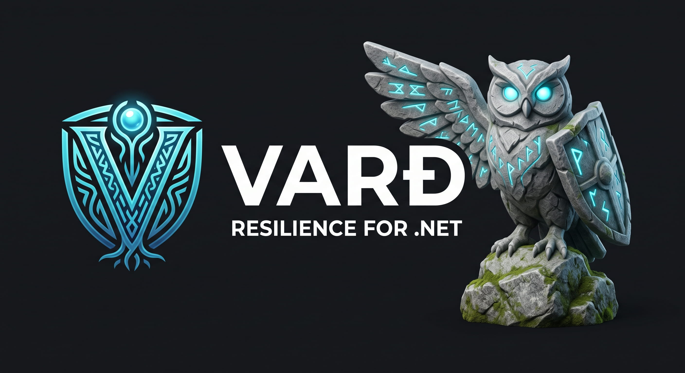
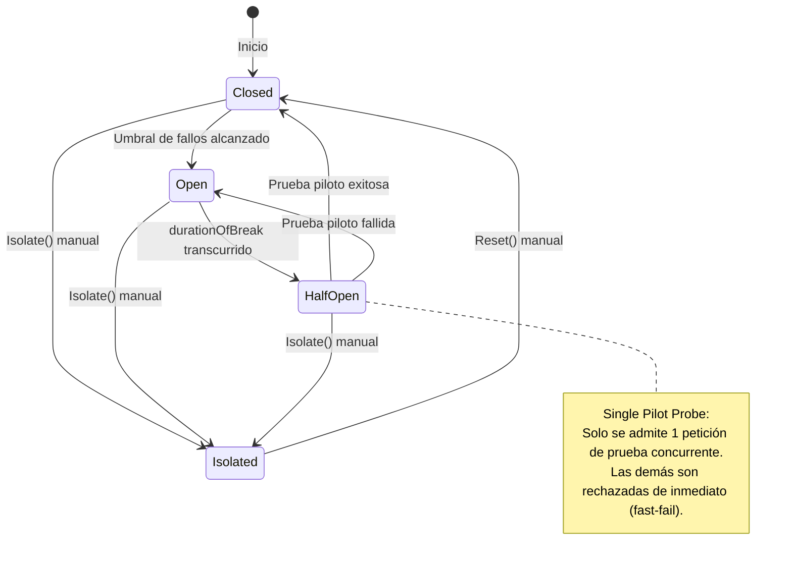
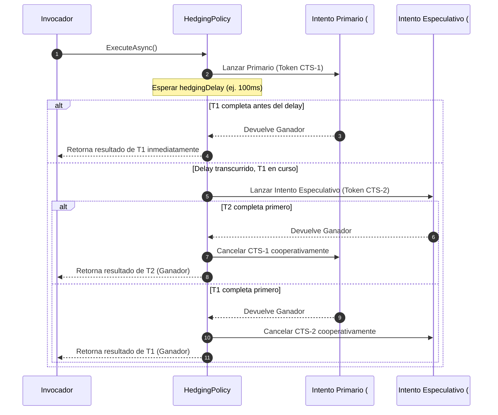

# Vard

<div align="center">
  
  <br/>

[](https://www.nuget.org/packages/Vard/)
[](https://learn.microsoft.com/es-es/dotnet/standard/net-standard)
[](#filosofía--ingeniería)
[](LICENSE)
[](#calidad--pruebas)

**Toolkit de resiliencia y tolerancia a fallos para .NET sin fricción, type-safe y con cero dependencias externas.**

[Português](README.md) | [English](README.en.md) | **Español**

</div>

---

## Índice

- [Visión General](#visión-general)
- [Filosofía & Ingeniería](#filosofía--ingeniería)
- [Instalación](#instalación)
- [Inicio Rápido](#inicio-rápido)
- [Arquitectura & Ingeniería Interna](#arquitectura--ingeniería-interna)
  - [Pipeline Canónico (Outside-In)](#1-pipeline-canónico-outside-in)
  - [Máquina de Estados del Circuit Breaker](#2-máquina-de-estados-del-circuit-breaker)
  - [Flujo Especulativo de Hedging](#3-flujo-especulativo-de-hedging)
- [Las 7 Políticas de Resiliencia](#las-7-políticas-de-resiliencia)
  - [1. Retry (Reintentos con Jitter)](#1-retry-reintentos-con-jitter)
  - [2. Circuit Breaker (Disyuntor Reactivo y Predictivo)](#2-circuit-breaker-disyuntor-reactivo-y-predictivo)
  - [3. Timeout (Cancelación Cooperativa)](#3-timeout-cancelación-cooperativa)
  - [4. Fallback (Degradación Agraciada)](#4-fallback-degradación-agraciada)
  - [5. Bulkhead (Aislamiento de Concurrencia)](#5-bulkhead-aislamiento-de-concurrencia)
  - [6. Rate Limiter (Control de Tasa)](#6-rate-limiter-control-de-tasa)
  - [7. Hedging (Ejecución Especulativa p99)](#7-hedging-ejecución-especulativa-p99)
- [Composición de Pipelines (PolicyWrap)](#composición-de-pipelines-policywrap)
  - [Pipeline Corporativo de Alta Disponibilidad](#pipeline-corporativo-de-alta-disponibilidad)
  - [Pipeline Especulativo de Baja Latencia](#pipeline-especulativo-de-baja-latencia)
- [Observabilidad, Contexto & PolicyResult](#observabilidad-contexto--policyresult)
- [Vard vs Polly](#vard-vs-polly)
- [Migración Automatizada de Polly a Vard (AI Skill)](#migración-automatizada-de-polly-a-vard-ai-skill)
- [Roadmap & Futuras Implementaciones](#roadmap--futuras-implementaciones)
- [Proyecto de Demostración (Demo)](#proyecto-de-demostración-demo)
- [Calidad & Pruebas](#calidad--pruebas)
- [Licencia](#licencia)

---

## Visión General

**Vard** es una biblioteca de tolerancia a fallos para .NET (.NET Standard 2.1+) diseñada para sistemas distribuidos de alta escala y microservicios críticos. Proporciona los 7 patrones esenciales de resiliencia con una API fluida e intuitiva, tiempos de ejecución predecibles y garantía absoluta de no introducir dependencias transitivas.

Construido bajo estrictos principios de aislamiento y estabilidad en producción, Vard protege las aplicaciones contra fallos en cascada, saturación del ThreadPool, picos de latencia (tail latency p99) e indisponibilidad de servicios externos.

---

## Filosofía & Ingeniería

- **Cero Dependencias Externas (Pure .NET BCL):** Vard depende exclusivamente de la biblioteca base (.NET Standard 2.1 BCL). Sin paquetes de terceros, eliminando por completo los conflictos de versiones (*dependency hell*).
- **Asignación Mínima & Zero-Alloc en Régimen Continuo:** Las ventanas deslizantes y limitadores de tasa emplean anillos circulares preasignados (`BucketedSlidingWindow`) con complejidad de tiempo $O(1)$ y cero asignaciones en el heap durante el tráfico continuo.
- **Coordinación Atómica sin Bloqueos (Lock-Free):** La máquina de estados del Circuit Breaker ejecuta transiciones atómicas mediante `Interlocked` (*Single Pilot Request*), impidiendo avalanchas concurrentes hacia dependencias en recuperación.
- **Token Bucket con Recarga Matemática Lazy:** Los tokens disponibles se calculan bajo demanda comparando marcas de tiempo monotónicas, sin desperdiciar timers en segundo plano ni hilos del ThreadPool.
- **Cancelación Cooperativa Genuina:** Todas las políticas asíncronas respetan y propagan `CancellationToken`, garantizando la liberación inmediata de conexiones y sockets HTTP.

---

## Instalación

Instalación mediante .NET CLI:

```bash
dotnet add package Vard
```

O mediante la consola del Administrador de Paquetes NuGet:

```powershell
Install-Package Vard
```

---

## Inicio Rápido

```csharp
using System;
using System.Net.Http;
using System.Threading.Tasks;
using Vard.Builders;
using Vard.Abstractions;

// Configurar política de reintentos con Backoff Exponencial y AWS Full Jitter
var retryPolicy = VardPolicy
    .Handle<HttpRequestException>()
    .Or<TimeoutException>()
    .RetryWithBackoff(
        retryCount: 3,
        initialDelay: TimeSpan.FromMilliseconds(100),
        backoffType: BackoffType.Exponential,
        useJitter: true,
        onRetryAsync: (ex, res, attempt, delay, ctx) =>
        {
            Console.WriteLine($"[Retry] Intento #{attempt} falló: {ex?.Message}. Esperando {delay.TotalMilliseconds:F0}ms...");
            return Task.CompletedTask;
        });

// Ejecutar operación protegida
var response = await retryPolicy.ExecuteAsync(async ct =>
{
    using var client = new HttpClient();
    return await client.GetStringAsync("https://api.ejemplo.com/datos", ct);
});
```

---

## Arquitectura & Ingeniería Interna

### 1. Pipeline Canónico (Outside-In)

Al combinar múltiples políticas, la ejecución sigue un modelo en capas **Outside-In**:


### 2. Máquina de Estados del Circuit Breaker

El Circuit Breaker implementa 4 estados con un **Single Pilot Request** atómico en `HalfOpen`:



### 3. Flujo Especulativo de Hedging

Hedging dispara ejecuciones concurrentes especulativas si la llamada inicial excede un umbral de tiempo, devolviendo el resultado más rápido y cancelando cooperativamente las demás:



---

## Las 7 Políticas de Resiliencia

### 1. Retry (Reintentos con Jitter)

Protege contra fallos transitorios con estrategias de backoff: Fijo, Lineal y Exponencial con AWS Full Jitter.

```csharp
var retry = VardPolicy
    .Handle<HttpRequestException>()
    .RetryWithBackoff(
        retryCount: 3,
        initialDelay: TimeSpan.FromMilliseconds(100),
        backoffType: BackoffType.Exponential,
        useJitter: true,
        onRetryAsync: (ex, res, attempt, delay, ctx) =>
        {
            Console.WriteLine($"Intento {attempt} fallido. Reintentando en {delay.TotalMilliseconds}ms");
            return Task.CompletedTask;
        });
```

### 2. Circuit Breaker (Disyuntor Reactivo y Predictivo)

Previene fallos en cascada cortando el tráfico hacia servicios no disponibles. Incluye variantes basadas en conteo (Count-based) y tasa de fallos en ventana deslizante (Rate-based).

```csharp
// Circuit Breaker basado en conteo
var breaker = VardPolicy
    .Handle<HttpRequestException>()
    .CircuitBreaker(
        exceptionsAllowedBeforeBreaking: 3,
        durationOfBreak: TimeSpan.FromSeconds(15),
        onBreak: (ex, duration, ctx) => Console.WriteLine($"Circuito ABIERTO por {duration.TotalSeconds}s"),
        onReset: ctx => Console.WriteLine("Circuito CERRADO"),
        onHalfOpen: ctx => Console.WriteLine("Circuito HALF-OPEN (probando petición piloto)"));

// Circuit Breaker avanzado basado en tasa (Sliding Window O(1))
var advancedBreaker = VardPolicy
    .Handle<HttpRequestException>()
    .AdvancedCircuitBreaker(
        failureThreshold: 0.5, // 50% de tasa de fallo
        samplingDuration: TimeSpan.FromSeconds(30),
        minimumThroughput: 20,
        durationOfBreak: TimeSpan.FromSeconds(10));
```

### 3. Timeout (Cancelación Cooperativa)

Asegura que las operaciones no se bloqueen indefinidamente mediante un `CancellationToken` vinculado.

```csharp
var timeout = VardPolicy.Timeout(
    timeout: TimeSpan.FromMilliseconds(500),
    onTimeout: (ctx, duration) => Console.WriteLine($"Excedido tiempo límite de {duration.TotalMilliseconds}ms"));

var data = await timeout.ExecuteAsync(async ct =>
{
    return await httpClient.GetStringAsync("https://api.ejemplo.com", ct);
});
```

### 4. Fallback

Proporciona un valor alternativo, datos por defecto o respuesta desde caché cuando la operación principal falla.

```csharp
var fallback = VardPolicy
    .Handle<HttpRequestException>()
    .Or<TimeoutRejectedException>()
    .Fallback(
        fallbackValue: "Datos locales en caché",
        onFallback: (ex, ctx) => Console.WriteLine($"Fallback activo: {ex?.Message}"));
```

### 5. Bulkhead (Aislamiento de Concurrencia)

Limita el número máximo de ejecuciones paralelas simultáneas y proporciona una cola acotada para evitar la saturación de recursos.

```csharp
var bulkhead = VardPolicy.Bulkhead(
    maxParallelization: 10,
    maxQueuedActions: 20,
    onBulkheadRejectedAsync: ctx =>
    {
        Console.WriteLine("Bulkhead saturado! Petición rechazada.");
        return Task.CompletedTask;
    });
```

### 6. Rate Limiter (Control de Tasa)

Protege APIs contra sobrecargas controlando la frecuencia de solicitudes. Soporta Token Bucket (burst + recarga continua) y Sliding Window (anillo circular $O(1)$).

```csharp
// Token Bucket: capacidad 100, recarga 20 tokens/segundo
var tokenBucket = VardPolicy.TokenBucket(
    maxTokens: 100,
    tokensPerSecond: 20.0,
    onRateLimitExceeded: (retryAfter, ctx) =>
    {
        Console.WriteLine($"Límite alcanzado! Reintentar en {retryAfter.TotalMilliseconds}ms");
    });

// Sliding Window: 100 peticiones por ventana de 1 minuto
var slidingWindow = VardPolicy.SlidingWindow(
    permitLimit: 100,
    windowDuration: TimeSpan.FromMinutes(1));
```

### 7. Hedging (Ejecución Especulativa p99)

Optimiza la latencia de cola (p99) disparando llamadas paralelas si el intento inicial tarda más de lo previsto, cancelando inmediatamente el perdedor.

```csharp
var hedging = VardPolicy
    .Handle<TimeoutException>()
    .Hedging<string>(
        maxHedges: 1, // Lanza 1 hedge paralelo adicional
        hedgingDelay: TimeSpan.FromMilliseconds(150),
        onHedgingResultAsync: (result, attempt, elapsed, ctx) =>
        {
            Console.WriteLine($"Hedge #{attempt} ganador en {elapsed.TotalMilliseconds}ms");
            return Task.CompletedTask;
        });
```

---

## Composición de Pipelines (PolicyWrap)

Las políticas pueden encadenarse fluidamente o mediante `.Wrap()` para crear pipelines multicapa.

### Pipeline Corporativo de Alta Disponibilidade

Orden canónico: `Fallback -> Retry -> CircuitBreaker -> Timeout -> Bulkhead`

```csharp
var pipeline = fallback
    .Wrap(retry)
    .Wrap(circuitBreaker)
    .Wrap(timeout)
    .Wrap(bulkhead);

var result = await pipeline.ExecuteAsync(async ct =>
{
    return await httpClient.GetStringAsync("https://servicio.interno/api", ct);
});
```

### Pipeline Especulativo de Baja Latencia

Orden canónico: `Fallback -> Hedging -> Timeout`

```csharp
var lowLatencyPipeline = fallback
    .Wrap(hedging)
    .Wrap(timeout);
```

---

## Observabilidad, Contexto & PolicyResult

Transmita metadatos contextuales (como `CorrelationId` o `TenantId`) y capture resultados sin excepciones mediante `ExecuteAndCapture`:

```csharp
var context = new Dictionary<string, object>
{
    ["CorrelationId"] = Guid.NewGuid().ToString("N"),
    ["Tenant"] = "Cliente-Empresarial"
};

PolicyResult<string> result = await pipeline.ExecuteAndCaptureAsync(async (ctx, ct) =>
{
    return await httpClient.GetStringAsync("https://api.ejemplo.com/items", ct);
}, context);

if (result.IsSuccess)
{
    Console.WriteLine($"Éxito: {result.Result}");
}
else
{
    Console.WriteLine($"Error capturado: {result.FinalException?.Message}");
    Console.WriteLine($"Tipo clasificado: {result.ExceptionType}");
    Console.WriteLine($"Controlado por Vard: {result.IsFaultHandled}");
}
```

---

## Vard vs Polly

| Característica | Vard | Polly (v7 / v8) |
| :--- | :--- | :--- |
| **Dependencias Externas en Runtime** | **Cero (0 dependencias)** — Pure .NET Standard 2.1 BCL | Múltiples dependencias transitivas (`Microsoft.Extensions.*`, etc.) |
| **Riesgo de Conflictos de Versión** | **Inexistente** | Posible en proyectos complejos (*dependency hell*) |
| **Framework Target Mínimo** | **.NET Standard 2.1+** (compatible con .NET Core 3.1 hasta .NET 9+) | .NET Standard 2.0 / .NET 6+ según la versión |
| **Hedging Especulativo** | **Nativo de primera clase** con linked CTS | Solo en versiones recientes (v8+) |
| **Métricas de Ventana Deslizante** | **O(1) CPU & Zero-Alloc** mediante anillo circular indexado | Varía según telemetría y buffers |
| **Recarga de Token Bucket** | **Matemática Lazy** (sin timers ociosos consumiendo ThreadPool) | Depende de instancias de `System.Threading.Timer` |
| **Prueba Piloto en Half-Open** | **Atómica sin bloqueos** con `Interlocked.CompareExchange` | Presente, con abstracciones internas mayores |
| **Curva de Aprendizaje & API** | **Directa y fluida**, unificada en un único namespace | Dividida entre arquitecturas legada (v7) y nueva (v8) |

---

## Migración Automatizada de Polly a Vard (AI Skill)

Para facilitar la transición de proyectos existentes que utilizan Polly a **Vard**, este repositorio incluye una **AI Skill** optimizada (`skills/migrate-polly-to-vard/SKILL.md`) compatible con agentes de IA (Claude, Gemini, Codex, Antigravity, etc.).

### Lo que la Skill hace automáticamente:
1. **Auditoría del Código:** Localiza referencias de paquetes (`Polly`, `Polly.Core`, `Polly.Extensions.Http`, etc.) y directivas `using Polly...;`.
2. **Sustitución de Paquetes:** Elimina las dependencias de Polly e instala el paquete `Vard` mediante la CLI de .NET.
3. **Reescritura de Código:** Mapea llamadas heredadas de Polly (`WaitAndRetryAsync`, `CircuitBreakerAsync`, `TimeoutAsync`, `FallbackAsync`, `BulkheadAsync`, `WrapAsync`) a la API equivalente de Vard.
4. **Validación y Pruebas:** Compila la solución (`dotnet build`) y ejecuta la suite de pruebas existente (`dotnet test`) para garantizar cero regresiones.

---

## Roadmap & Futuras Implementaciones

Plan de evolución técnica para futuras versiones:

### 1. Paquetes de Integración con el Ecosistema Moderno .NET (Paquetes Satélites)
- **`Vard.Extensions.DependencyInjection`:** Métodos fluidos `services.AddVard()` para registro en el contenedor de DI nativo de .NET.
- **`Vard.Extensions.Logging` / Telemetría:** Integración transparente con `ILogger` y métricas/tracing compatibles con OpenTelemetry y Serilog.

### 2. Políticas y Utilidades Avanzadas (Manteniendo Cero Dependencias)
- **`PolicyRegistry`:** Repositorio nombrado centralizado para registrar, recuperar y reutilizar políticas y pipelines en la aplicación.
- **`CachePolicy`:** Política de caché en memoria para memorizar respuestas de delegados idempotentes y evitar llamadas redundantes.
- **`FallbackPolicy` Mejorado:** Selección dinámica de claves y estrategias de degradación agraciada.

### 3. Mejoras de Resiliencia en Streaming
- **Soporte para `IAsyncEnumerable<T>`:** Ejecución resiliente con tratamiento de `Retry` y `Timeout` en flujos continuos de datos (streaming).

---

## Proyecto de Demostración (Demo)

El repositorio incluye un proyecto de consola listo para ejecutar que demuestra todas las políticas en acción:

```bash
# Ejecutar la demo interactiva
dotnet run --project demo/Vard.Demo/Vard.Demo.csproj
```

---

## Calidad & Pruebas

Vard está respaldado por una suite rigurosa de **226 pruebas automatizadas** con **100% de éxito**:

- **Pruebas Unitarias:** Casos límite, agotamiento de límites y transiciones atómicas de máquinas de estado.
- **Pruebas de Concurrencia:** Simulaciones de alto estrés validando la seguridad de hilos en los semáforos de Bulkhead, buckets de Rate Limiter y operaciones CAS de Circuit Breaker.
- **Pruebas de Integración de Pipelines:** Pipelines multicapa verificando el aislamiento de fallos y la propagación de cancelaciones y contexto.
- **Compilación Estricta:** Compilación Release con `<TreatWarningsAsErrors>true</TreatWarningsAsErrors>` y 100% de documentación XML pública.

```bash
dotnet test -c Release
```

---

## Licencia

Distribuido bajo licencia [MIT](LICENSE). Copyright (c) 2026 Junior Schröder.
