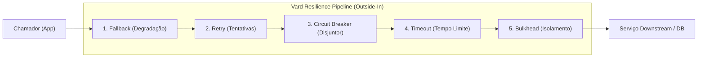
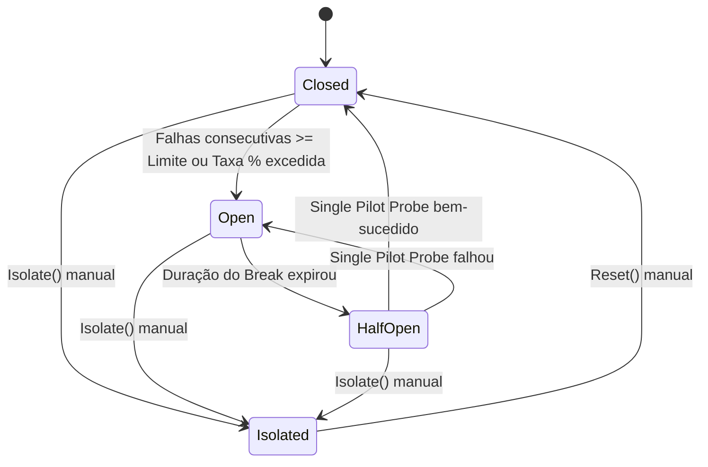
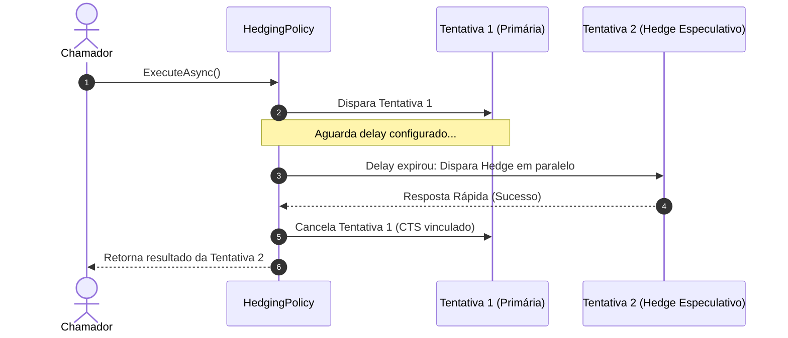

# Vard

<div align="center">
  
  <br/>

[](https://www.nuget.org/packages/Vard/)
[](https://learn.microsoft.com/en-us/dotnet/standard/net-standard)
[](#filosofia--engenharia)
[](LICENSE)
[](#qualidade--testes)

**Toolkit de resiliência e tolerância a falhas para .NET sem atrito, type-safe e com zero dependências externas.**

**Português** | [English](README.en.md) | [Español](README.es.md)

</div>

---

## Índice

- [Visão Geral](#visão-geral)
- [Filosofia & Engenharia](#filosofia--engenharia)
- [Instalação](#instalação)
- [Quickstart](#quickstart)
- [Arquitetura & Engenharia Interna](#arquitetura--engenharia-interna)
  - [Pipeline Canônico (Outside-In)](#1-pipeline-canônico-outside-in)
  - [Máquina de Estados do Circuit Breaker](#2-máquina-de-estados-do-circuit-breaker)
  - [Fluxo Especulativo do Hedging](#3-fluxo-especulativo-do-hedging)
- [As 7 Políticas de Resiliência](#as-7-políticas-de-resiliência)
  - [1. Retry (Tentativas com Jitter)](#1-retry-tentativas-com-jitter)
  - [2. Circuit Breaker (Disjuntor Reativo e Preditivo)](#2-circuit-breaker-disjuntor-reativo-e-preditivo)
  - [3. Timeout (Cancelamento Cooperativo)](#3-timeout-cancelamento-cooperativo)
  - [4. Fallback (Degradação Graciosa)](#4-fallback-degradação-graciosa)
  - [5. Bulkhead (Isolamento de Concorrência)](#5-bulkhead-isolamento-de-concorrência)
  - [6. Rate Limiter (Controle de Vazão)](#6-rate-limiter-controle-de-vazão)
  - [7. Hedging (Disparo Especulativo p99)](#7-hedging-disparo-especulativo-p99)
- [Composição de Pipelines (PolicyWrap)](#composição-de-pipelines-policywrap)
  - [Pipeline Corporativo de Alta Disponibilidade](#pipeline-corporativo-de-alta-disponibilidade)
  - [Pipeline Especulativo de Baixa Latência](#pipeline-especulativo-de-baixa-latência)
- [Observabilidade, Contexto & PolicyResult](#observabilidade-contexto--policyresult)
- [Vard vs Polly](#vard-vs-polly)
- [Roadmap & Futuras Implementações](#roadmap--futuras-implementações)
- [Projeto de Demonstração (Demo)](#projeto-de-demonstração-demo)
- [Qualidade & Testes](#qualidade--testes)
- [Licença](#licença)

---

## Visão Geral

O **Vard** é uma biblioteca de tolerância a falhas para .NET (.NET Standard 2.1+) desenhada para sistemas modernos de alta escala e microsserviços críticos. Ele oferece as 7 políticas essenciais de engenharia de resiliência com uma API fluente intuitiva, tempos de execução previsíveis e garantia absoluta de não poluir sua árvore de dependências transitivas.

Construído sob os princípios de isolamento estrito e estabilidade de produção, o Vard protege aplicações contra falhas em cascata, contenção de conexões, picos de latência (tail latency p99) e indisponibilidade de serviços downstream.

---

## Filosofia & Engenharia

- **Zero Dependências Externas (Pure .NET BCL):** O Vard depende única e exclusivamente da biblioteca base (.NET Standard 2.1 BCL). Sem pacotes transitivos, sem riscos de incompatibilidade de versão de logging ou abstrações de terceiros (*dependency hell*).
- **Alocação Mínima & Zero-Alloc em Regime Contínuo:** Janelas deslizantes e limitadores de taxa utilizam estruturas circulares pré-alocadas (`BucketedSlidingWindow`) com complexidade de tempo $O(1)$ e zero alocações na heap durante o fluxo estável de requisições.
- **Coordenação Atômica sem Travamento Ocioso:** A máquina de estados do Circuit Breaker implementa transições atômicas via `Interlocked` (*Single Pilot Request*), prevenindo que múltiplas threads simultâneas sobrecarreguem um serviço convalescente.
- **Recarga Matemática Lazy:** O limitador de taxa Token Bucket calcula tokens disponíveis por diferença de tempo monotônico em vez de manter timers e threads em segundo plano no ThreadPool.
- **Cancelamento Cooperativo Genuíno:** Todas as políticas assíncronas propagam e respeitam `CancellationToken`, garantindo liberação imediata de sockets e conexões HTTP.

---

## Instalação

Adicione o pacote ao seu projeto via .NET CLI:

```bash
dotnet add package Vard
```

Ou através do Package Manager Console no Visual Studio:

```powershell
Install-Package Vard
```

---

## Quickstart

Proteja uma chamada HTTP downstream com tentativas automáticas e backoff exponencial com jitter em menos de 5 linhas de código:

```csharp
using System;
using System.Net.Http;
using System.Threading.Tasks;
using Vard.Builders;

var httpClient = new HttpClient();

// Cria política de retry para falhas de rede com backoff exponencial + Full Jitter
var retryPolicy = VardPolicy
    .Handle<HttpRequestException>()
    .RetryWithBackoff(
        retryCount: 3,
        initialDelay: TimeSpan.FromMilliseconds(200),
        backoffType: BackoffType.ExponentialWithJitter,
        onRetry: (ex, attempt, delay, ctx) =>
        {
            Console.WriteLine($"Tentativa {attempt} falhou ({ex.Message}). Aguardando {delay.TotalMilliseconds}ms...");
        });

// Executa a operação com proteção resiliente
var response = await retryPolicy.ExecuteAsync(async ct =>
{
    return await httpClient.GetStringAsync("https://api.exemplo.com/dados");
});
```

---

## Arquitetura & Engenharia Interna

### 1. Pipeline Canônico (Outside-In)

Quando múltiplas políticas são combinadas através do `PolicyWrap`, o fluxo de execução opera em camadas **Outside-In** (de fora para dentro). A camada externa intercepta o resultado das camadas internas, garantindo que o `Fallback` capture erros do `Retry`, o `Retry` tente novamente erros do `Circuit Breaker`, e o `Circuit Breaker` proteja o `Timeout` e `Bulkhead`:



### 2. Máquina de Estados do Circuit Breaker

O Circuit Breaker gerencia transições atômicas entre 4 estados operacionais:



- **Closed:** Operação normal. Todas as requisições passam. Falhas são contabilizadas.
- **Open:** Circuito aberto. Todas as requisições sofrem fail-fast imediato com `CircuitBreakerOpenException` sem onerar a dependência downstream.
- **HalfOpen:** Fase de sondagem. O Vard emprega o algoritmo atômico **Single Pilot Request** via `Interlocked.CompareExchange`: apenas uma única requisição piloto tem permissão de executar; as demais continuam sendo rejeitadas instantaneamente até que o piloto confirme se o serviço se recuperou ou não.
- **Isolated:** Circuito bloqueado administrativamente para manutenção via `policy.Isolate()`. Somente é reaberto chamando explicitamente `policy.Reset()`.

### 3. Fluxo Especulativo do Hedging

Para serviços distribuídos onde o percentil de latência p99 degrada a experiência do usuário, o Hedging dispara tentativas redundantes em paralelo quando a requisição primária excede um limiar aceitável:



---

## As 7 Políticas de Resiliência

### 1. Retry (Tentativas com Jitter)

Evita falhas temporárias causadas por instabilidades de rede, locks temporários de banco de dados ou indisponibilidades efêmeras. Suporta backoff fixo, linear e exponencial com algoritmo **Full Jitter** da AWS para evitar ondas de sincronização harmônica (*thundering herd*).

```csharp
var retryPolicy = VardPolicy
    .Handle<HttpRequestException>()
    .Or<TimeoutException>()
    .RetryWithBackoff(
        retryCount: 3,
        initialDelay: TimeSpan.FromMilliseconds(150),
        backoffType: BackoffType.ExponentialWithJitter,
        onRetry: (ex, attempt, delay, context) =>
        {
            Console.WriteLine($"[Retry {attempt}] Aguardando {delay.TotalMilliseconds:F0}ms devido a: {ex.Message}");
        });

await retryPolicy.ExecuteAsync(async ct =>
{
    await ExecutarOperacaoInstavelAsync(ct);
});
```

Também é possível filtrar por resultados específicos utilizando `HandleResult`:

```csharp
var retryOnStatus = VardPolicy
    .HandleResult<HttpResponseMessage>(res => res.StatusCode == HttpStatusCode.ServiceUnavailable)
    .Retry(retryCount: 2);
```

---

### 2. Circuit Breaker (Disjuntor Reativo e Preditivo)

Interrompe o fluxo de chamadas para um serviço com falhas, permitindo que ele se recupere sem ser soterrado por requisições condenadas ao fracasso.

#### Count-Based (Baseado em contagem consecutiva)

```csharp
var countCb = VardPolicy
    .Handle<HttpRequestException>()
    .CircuitBreaker(
        exceptionsAllowedBeforeBreaking: 5,
        durationOfBreak: TimeSpan.FromSeconds(30),
        onBreak: (ex, breakDuration, context) =>
        {
            Console.WriteLine($"[ALERTA] Circuito ABERTO por {breakDuration.TotalSeconds}s devido a: {ex?.Message}");
        },
        onReset: context => Console.WriteLine("[INFO] Circuito FECHADO - Operação normal restabelecida."),
        onHalfOpen: context => Console.WriteLine("[INFO] Circuito HALF-OPEN - Enviando requisição piloto...")
    );
```

#### Advanced Rate-Based (Janela deslizante O(1) e taxa percentual de falhas)

Calcula a proporção de falhas dentro de uma janela deslizante amostral particionada em anel circular:

```csharp
var advancedCb = VardPolicy
    .Handle<HttpRequestException>()
    .AdvancedCircuitBreaker(
        failureThreshold: 0.5,                    // Abre se 50% ou mais das chamadas falharem
        samplingDuration: TimeSpan.FromSeconds(10), // Janela amostral deslizante de 10 segundos
        minimumThroughput: 8,                      // Mínimo de 8 chamadas na janela para avaliar taxa
        durationOfBreak: TimeSpan.FromSeconds(20),
        onBreak: (ex, duration, ctx) => Console.WriteLine($"Taxa de falhas excedeu 50%! Break de {duration.TotalSeconds}s.")
    );

// Controle administrativo manual (manutenção ou chaveamento operacional)
advancedCb.Isolate(); // Força abertura imediata
advancedCb.Reset();   // Restaura imediatamente para o estado Closed
```

---

### 3. Timeout (Cancelamento Cooperativo)

Impõe um tempo limite rígido sobre a operação. Cancela cooperativamente o `CancellationToken` repassado à operação e lança `TimeoutRejectedException` se o prazo expirar.

```csharp
var timeoutPolicy = VardPolicy.Timeout(
    timeout: TimeSpan.FromSeconds(2),
    onTimeout: (ctx, duration) =>
    {
        Console.WriteLine($"Operação abortada após exceder o limite de {duration.TotalSeconds}s.");
    });

try
{
    await timeoutPolicy.ExecuteAsync(async ct =>
    {
        // ct será cancelado cooperativamente se passar de 2 segundos
        await httpClient.GetAsync("https://servico-lento.exemplo.com", ct);
    });
}
catch (TimeoutRejectedException ex)
{
    Console.WriteLine($"Timeout rejeitado: {ex.Timeout.TotalSeconds}s excedidos.");
}
```

---

### 4. Fallback

Permite retornar um valor substituto, carregar dados de um cache local ou disparar um fluxo secundário quando a operação principal falha.

```csharp
// Fallback com valor substituto constante ou computado
var fallbackPolicy = VardPolicy
    .Handle<HttpRequestException>()
    .Or<TimeoutRejectedException>()
    .Fallback<string>(
        fallbackValue: "{\"status\": \"dados_degradados_offline\"}",
        onFallback: (ex, ctx) =>
        {
            Console.WriteLine($"Fallback acionado devido a: {ex.Message}");
        });

var json = await fallbackPolicy.ExecuteAsync(async ct =>
{
    return await httpClient.GetStringAsync("https://catalogo.exemplo.com/itens", ct);
});
```

Também suporta delegates assíncronos dinâmicos baseados no contexto da falha:

```csharp
var dynamicFallback = VardPolicy
    .Handle<Exception>()
    .FallbackAsync<UserProfile>(async (ex, ctx, ct) =>
    {
        var userId = ctx["UserId"]?.ToString();
        return await localCache.GetProfileAsync(userId, ct);
    });
```

---

### 5. Bulkhead (Isolamento de Concorrência)

Limita o número de execuções simultâneas em um recurso compartilhado (como pool de threads de banco de dados ou chamadas a parceiro lento), isolando falhas para que não esgotem a capacidade de todo o processo.

```csharp
var bulkhead = VardPolicy.Bulkhead(
    maxParallelization: 10,   // Máximo de 10 chamadas ativas em paralelo
    maxQueuedActions: 5,      // Capacidade da fila de espera para até 5 chamadas adicionais
    onBulkheadRejected: ctx =>
    {
        Console.WriteLine("Bulkhead saturado! Chamada rejeitada imediatamente para evitar exaustão.");
    });

// Se houver mais de 15 chamadas (10 ativas + 5 na fila), lança BulkheadRejectedException instantaneamente
await bulkhead.ExecuteAsync(async ct =>
{
    await ProcessarTransacaoFinanceiraAsync(ct);
});
```

---

### 6. Rate Limiter (Controle de Vazão)

Controla o ritmo de consumo de APIs e protege endpoints contra sobrecarga, suportando dois algoritmos complementares de nível de produção.

#### Token Bucket (Permite bursts naturais)

Recarga matemática contínua e sem timers de background ociosos:

```csharp
// Bucket com capacidade para 100 tokens e recarga contínua de 10 tokens por segundo
var tokenBucket = VardPolicy.TokenBucket(
    maxTokens: 100,
    tokensPerSecond: 10.0,
    maxWaitTime: TimeSpan.FromMilliseconds(500), // Aguarda até 500ms se bucket estiver vazio
    onRateLimitExceeded: (retryAfter, ctx) =>
    {
        Console.WriteLine($"Taxa excedida. Tente novamente em {retryAfter.TotalMilliseconds}ms.");
    });

await tokenBucket.ExecuteAsync(async ct =>
{
    await EnviarEventoParaFilaAsync(ct);
});
```

#### Sliding Window (Janela Deslizante Segmentada O(1))

Distribui o limite de forma linear ao longo de segmentos de tempo com verificação de complexidade constante:

```csharp
// Limite estrito de 50 requisições por segundo particionado em 10 segmentos de 100ms
var slidingWindow = VardPolicy.SlidingWindow(
    permitLimit: 50,
    windowDuration: TimeSpan.FromSeconds(1),
    segmentsPerWindow: 10
);

await slidingWindow.ExecuteAsync(async ct =>
{
    await ConsultarEndpointExternoAsync(ct);
});
```

---

### 7. Hedging (Disparo Especulativo p99)

Combate a variação de latência em cauda (*tail latency*) em microsserviços distribuídos de missão crítica. Se a primeira chamada demorar mais do que um tempo aceitável, uma segunda requisição especulativa é disparada em paralelo. O primeiro resultado que concluir com sucesso vence, e as requisições restantes são canceladas cooperativamente.

```csharp
var hedgingPolicy = VardPolicy
    .Handle<HttpRequestException>()
    .Or<TimeoutException>()
    .Hedging<string>(
        maxHedges: 2,                                // Até 2 tentativas adicionais especulativas
        hedgingDelay: TimeSpan.FromMilliseconds(200), // Dispara hedge se requisição primária passar de 200ms
        onHedgingResult: (attempt, res, ex) =>
        {
            Console.WriteLine($"Tentativa hedge {attempt} concluída.");
        });

// Garante retorno rápido no menor tempo possível sem penalizar o usuário com spikes de latência
var resultado = await hedgingPolicy.ExecuteAsync(async ct =>
{
    return await ConsultarServicoDistribuidoAsync(ct);
});
```

---

## Composição de Pipelines (PolicyWrap)

As políticas do Vard podem ser encadeadas usando `.Wrap()` ou através de `VardPolicy.Wrap(...)`, preservando a semântica hierárquica e a propagação unificada de contexto.

### Pipeline Corporativo de Alta Disponibilidade

Topologia recomendada para comunicação resiliente com microsserviços externos e bancos de dados:

```csharp
// 1. Fallback: Retorna resposta em modo degradado se tudo falhar
var fallback = VardPolicy.Handle<Exception>()
    .Fallback<ApiResponse>(() => ApiResponse.DegradedResponse());

// 2. Retry: Tenta 3 vezes com backoff exponencial se houver erro transiente de rede
var retry = VardPolicy.Handle<HttpRequestException>()
    .RetryWithBackoff(3, TimeSpan.FromMilliseconds(200), BackoffType.ExponentialWithJitter);

// 3. Circuit Breaker: Abre o disjuntor após 5 falhas consecutivas persistentes
var circuitBreaker = VardPolicy.Handle<HttpRequestException>()
    .CircuitBreaker(5, TimeSpan.FromSeconds(30));

// 4. Timeout: Cancela chamadas individuais que excederem 3 segundos
var timeout = VardPolicy.Timeout(TimeSpan.FromSeconds(3));

// 5. Bulkhead: Limita no máximo 20 chamadas paralelas simultâneas
var bulkhead = VardPolicy.Bulkhead(maxParallelization: 20, maxQueuedActions: 10);

// Composição Outside-In fluente:
var pipeline = fallback
    .Wrap(retry)
    .Wrap(circuitBreaker)
    .Wrap(timeout)
    .Wrap(bulkhead);

// Execução segura e blindada
var resposta = await pipeline.ExecuteAsync(async ct =>
{
    return await clienteHttp.ChamarServicoAsync(ct);
});
```

### Pipeline Especulativo de Baixa Latência

Topologia recomendada para sistemas de recomendação, cotações em tempo real e mecanismos de busca:

```csharp
var fallback = VardPolicy.Handle<Exception>()
    .Fallback<CotacaoResponse>(CotacaoResponse.ValorPadrao);

var hedging = VardPolicy.Handle<Exception>()
    .Hedging<CotacaoResponse>(maxHedges: 1, hedgingDelay: TimeSpan.FromMilliseconds(100));

var timeout = VardPolicy.Timeout(TimeSpan.FromMilliseconds(400));

// Composição Outside-In via factory direta:
var fastPipeline = VardPolicy.Wrap(fallback, hedging, timeout);

var cotacao = await fastPipeline.ExecuteAsync(async ct =>
{
    return await ObterCotacaoEmTempoRealAsync(ct);
});
```

---

## Observabilidade, Contexto & PolicyResult

### Dicionário Estruturado Context

Todas as políticas compartilham e enriquecem uma instância de `IDictionary<string, object>` ao longo de todas as camadas do pipeline:

```csharp
var context = new Dictionary<string, object>
{
    ["CorrelationId"] = Guid.NewGuid().ToString(),
    ["TenantId"] = "tenant-enterprise-42"
};

var resultado = await pipeline.ExecuteAsync(async (ctx, ct) =>
{
    var correlation = ctx["CorrelationId"];
    return await ProcessarRequisicaoAsync(correlation, ct);
}, context);
```

### Execução Funcional sem Try/Catch com PolicyResult

O Vard oferece os métodos `ExecuteAndCapture` e `ExecuteAndCaptureAsync`, retornando uma estrutura imutável de resultado:

```csharp
PolicyResult<string> result = await pipeline.ExecuteAndCaptureAsync(async ct =>
{
    return await httpClient.GetStringAsync("https://api.exemplo.com/itens", ct);
});

if (result.IsSuccess)
{
    Console.WriteLine($"Sucesso: {result.Result}");
}
else
{
    Console.WriteLine($"Falha capturada: {result.FinalException?.Message}");
    Console.WriteLine($"Tipo de falha classificado: {result.ExceptionType}");
    Console.WriteLine($"Handled pelo Vard: {result.IsFaultHandled}");
}
```

---

## Vard vs Polly

| Característica | Vard | Polly (v7 / v8) |
| :--- | :--- | :--- |
| **Dependências Externas em Runtime** | **Zero (0 dependências)** — Pura BCL .NET Standard 2.1 | Múltiplas dependências transitivas (`Microsoft.Extensions.*`, etc.) |
| **Risco de Dependency Hell** | **Inexistente** | Possível em soluções complexas com conflitos de versão |
| **Framework Target Mínimo** | **.NET Standard 2.1+** (compatível com .NET Core 3.1 até .NET 9+) | .NET Standard 2.0 / .NET 6+ dependendo da versão |
| **Hedging Especulativo** | **Nativo de primeira classe** com linked CTS | Apenas nas versões mais recentes (v8+) |
| **Janela Deslizante de Métricas** | **O(1) CPU & Zero-Alloc** via anel circular indexado | Varia conforme telemetria e buffers |
| **Recarga do Token Bucket** | **Lazy matemática** (sem timers em background consumindo ThreadPool) | Depende de instâncias de `System.Threading.Timer` |
| **Single Pilot Request em Half-Open** | **Atômico** com `Interlocked.CompareExchange` | Presente, com abstrações internas maiores |
| **Curva de Aprendizado & API** | **Direta e fluente**, unificada em uma única namespace | Bifurcada entre arquitetura legada (v7) e nova (v8) |

---

## Roadmap & Futuras Implementações

O desenvolvimento contínuo do **Vard** prevê a expansão de seus recursos em futuras versões. Abaixo está a relação das funcionalidades planejadas para implementação:

### 1. Pacotes de Integração com o Ecossistema Moderno .NET (Pacotes Satélites)
- **`Vard.Extensions.DependencyInjection`:** Métodos `services.AddVard()` para registro fluente e resolução no container nativo de injeção de dependências do .NET.
- **`Vard.Extensions.Logging` / Telemetria:** Integração transparente com `ILogger` e métricas/tracing compatíveis com OpenTelemetry e Serilog.

### 2. Políticas e Utilitários Avançados (Mantendo Zero Dependencies)
- **`PolicyRegistry`:** Repositório nomeado centralizado para registrar, recuperar e reutilizar políticas e pipelines por toda a aplicação.
- **`CachePolicy`:** Política de cache in-memory para memorizar resultados de delegates idempotentes e evitar processamento redundante.
- **`FallbackPolicy` Aprimorado:** Suporte a chave de degradação graciosa com seleção de estratégias dinâmicas.

### 3. Melhorias de Resiliência em Streaming
- **Suporte a `IAsyncEnumerable<T>`:** Execução resiliente com tratamento de `Retry` e `Timeout` em fluxos contínuos de dados (streaming).

---

## Projeto de Demonstração (Demo)

A solution inclui um projeto de console executável com exemplos interativos e coloridos para cada política e pipeline:

```bash
# Executar a demonstração interativa
dotnet run --project demo/Vard.Demo/Vard.Demo.csproj
```

O projeto demonstra em tempo real:
1. **Retry** com backoff exponencial e AWS Full Jitter.
2. **Circuit Breaker** com contagem consecutiva, fast-fail e *Single Pilot Request* em Half-Open.
3. **Timeout & Fallback** com cancelamento cooperativo e resposta alternativa segura.
4. **Bulkhead** com contenção de concorrência e fila de espera.
5. **Rate Limiter** com recarga matemática contínua (Token Bucket).
6. **Hedging** com execuções especulativas paralelas e cancelamento cooperativo do perdedor.
7. **Pipeline Corporativo Completo** (`Fallback -> Retry -> CircuitBreaker -> Timeout`) com enriquecimento de `Context` e CorrelationId.

---

## Qualidade & Testes

A integridade do Vard é garantida por uma suíte rigorosa de **226 testes automatizados** com **100% de aprovação**:

- **Testes Unitários:** Validação exaustiva de cada política individualmente, cobrindo cenários de borda, estorno de limites, overflows e estados atômicos.
- **Testes de Concorrência:** Simulações com múltiplas threads paralelas disputando slots de semáforo do Bulkhead, buckets do Rate Limiter e transições do Circuit Breaker.
- **Testes de Integração de Pipeline:** Validação de pipelines corporativos de 5 camadas, garantindo isolamento entre falhas, propagação de cancelamentos e integridade de contexto.
- **Compilação Estrita:** Compilado em modo Release com `<TreatWarningsAsErrors>true</TreatWarningsAsErrors>` e documentação XML pública 100% completa.

```bash
# Execução da suíte completa de testes
dotnet test -c Release
```

---

## Licença

Distribuído sob a licença [MIT](LICENSE). Copyright (c) 2026 Junior Schröder.
